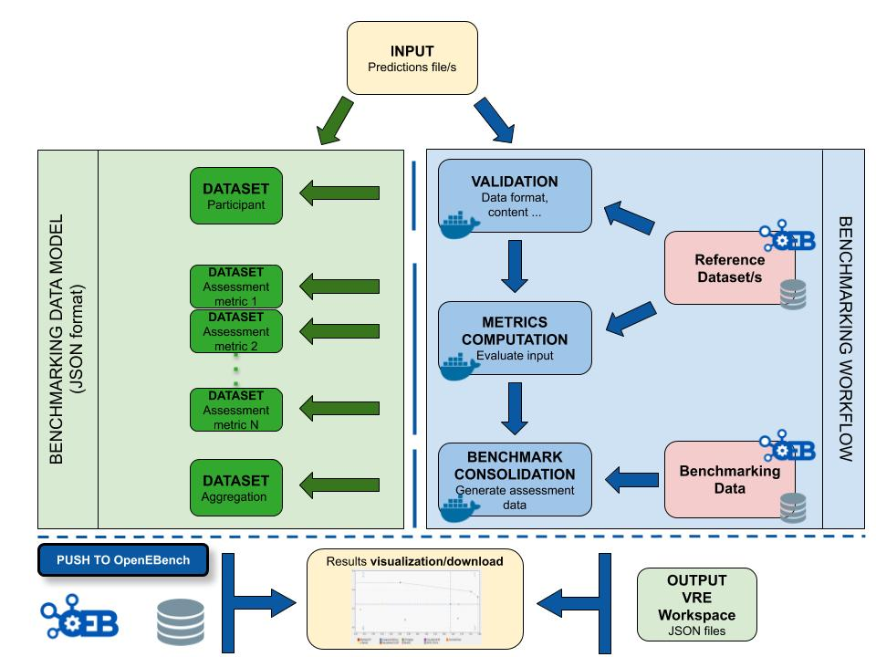

# OpenEBench assessment workflow with Nextflow

Example pipeline with Nextflow used to assess results, comparing the metrics being computed with this workflow with TCGA results.

Nextflow workflows following the same structure as this repo's example will be integratable into the OpenEBench [Virtual Research Environment (VRE)](https://openebench.bsc.es/submission/workspace/).

## Description

The workflow takes an input file with Cancer Driver Genes predictions (i.e. the results provided by a participant), computes a set of metrics, and compares them against the data currently stored in OpenEBench within the TCGA community. Two assessment metrics are provided for that predicitions. Also, some plots (which are optional) that allow to visualize the performance of the tool are generated. The workflow consists in three standard steps, defined by OpenEBench. The tools needed to run these steps must be in one or more Docker images, generated from [Docker containers](https://github.com/inab/TCGA_visualizer). Separated instances are spawned from these images for each step:
1. **Validation**: the input file format is checked and, if required, the content of the file is validated (e.g check whether the submitted gene IDs exist)
2. **Metrics Computation**: the predictions are compared with the 'Gold Standards' provided by the community, which results in two performance metrics - precision (Positive Predictive Value) and recall(True Positive Rate).
3. **Results Consolidation**: the benchmark itself is performed by merging the tool metrics with the rest of TCGA data. The results are provided in JSON format and SVG format (scatter plot).

## Data

* [TCGA_sample_data](https://github.com/javi-gv94/TCGA_nf_workflow/tree/master/TCGA_sample_data) folder contains all the reference data required by the steps. It is derived from the manuscript:
[Comprehensive Characterization of Cancer Driver Genes and Mutations](https://www.cell.com/cell/fulltext/S0092-8674%2818%2930237-X?code=cell-site), Bailey et al, 2018, Cell  
* [sample_out](https://github.com/javi-gv94/TCGA_nf_workflow/tree/master/sample_out) folder contains an example output for a worklow run, with two cancer types / challenges selected (ACC, BRCA)

## Usage
In order to use the workflow you need to:
* Install [Nextflow](https://www.nextflow.io/)
* Clone [this repository](https://github.com/inab/TCGA_visualizer) in a separate directory, and build locally the three Docker images found in it, running the `build.sh` script within that repo.
* Run it just using *'nextflow run main.nf'*

Default input parameters and Docker images to use for each step can be specified in the [config](https://github.com/javi-gv94/TCGA_nf_workflow/blob/master/nextflow.config) file
